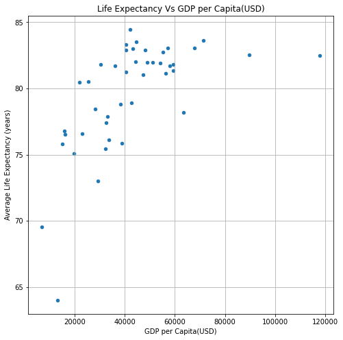
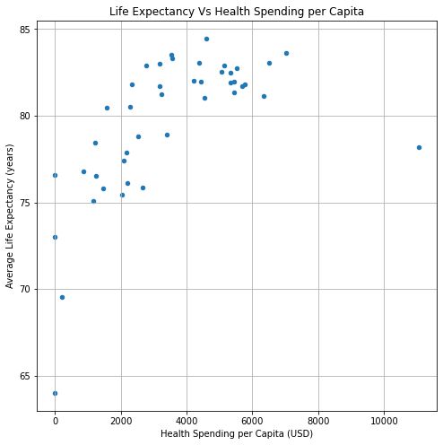
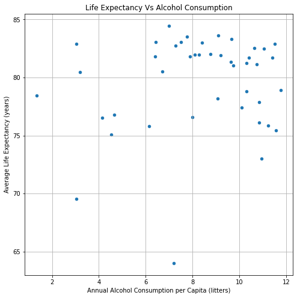
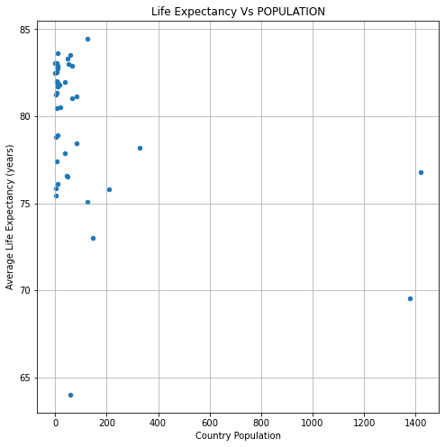
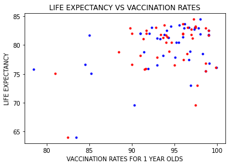
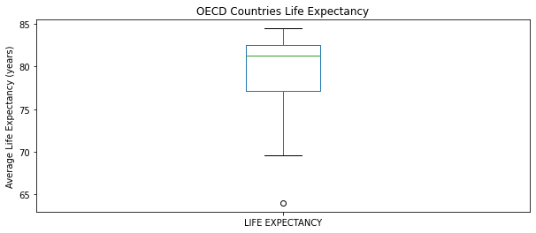

This is our Life Expectancy Data Analytics Project!

We set out to answer 6 key questions regarding Life Expectancy.

1. How is life expectancy in a country affected by Alcohol Consumption, GDP, Population, Vaccination DTP, Vaccination Measles and, Health Spending?

2. Do countries with higher GDPs have higher life expectancies? 

3. Should a country having a lower life expectancy value(<65) increase its 
healthcare expenditure in order to improve its average lifespan? 

4. Does Life Expectancy have a positive or negative relationship with 
drinking alcohol?

5. Do densely populated countries tend to have lower life expectancy?

6. What is the impact of Immunization coverage has on Life Expectancy?

-------------------------
We combined data from the The Organisation for Economic Co-operation and Development (OECD) for use in our analysis.
you can find these data at:

Life Expectancy: https://data.oecd.org/healthstat/life-expectancy-at-birth.htm,

Alcohol Consumption: https://data.oecd.org/healthrisk/alcohol-consumption.htm, 

GDP: https://data.oecd.org/gdp/gross-domestic-product-gdp.htm, 

Population: https://data.oecd.org/pop/population.htm, 

Youth Vaccination: https://data.oecd.org/healthcare/child-vaccination-rates.htm, 

Health Spending: https://data.oecd.org/healthres/health-spending.htm

-------------------------

Do countries with higher GDPs have higher life expectancies? 

GDP Stats- Max: 117794; Min: 6998; Median: 40648; Mean: 42688
Life Expectancy vs GDP Correlation: 62%; 
Mean of GDP for countries with life expectancy below 81: 27922
Mean of GDP for countries with life expectancy over 81: 54377

T-test Results (statistic=-5.5, pvalue=0.0000023)

Based on our data it appears that a higher gdp is positively correlated with a higher life expectancy

Should a country having a lower life expectancy value(<65) increase its healthcare expenditure in order to improve its average lifespan?

Health Spending Stats- Max: 11055; Min: 222; Median: 3247; Mean: 3505
Life Expectancy vs Health Spending Correlation: 62%;

In general more spending on healthcare has a net positive affect. Our data suggests that countries with a low life expectancies tend to benefit more from an increase in healthcare spending.

Does Life Expectancy have a positive or negative relationship with 
drinking alcohol?

Alcohol Stats- Max: 11.8; Min: 1.4; Median: 8.8; Mean: 8.27
Life Expectancy vs Health Spending Correlation: 15%;
Mean of ALCOHOL for countries with life expectancy below 81: 7.7
Mean of ALCOHOL for countries with life expectancy over 81: 8.8
T-test Results (statistic=-1.25, pvalue=0.22)

Our data indicates a slight positive correlation between alcohol sales and life expectancy.

Do densely populated countries tend to have lower life expectancy?

Our data indicates that higher populations correlate with lower life expectancies. 

Mean of POPULATION for countries with life expectancy below 81: 207
Mean of POPULATION for countries with life expectancy over 81: 27
T-test Results (statistic=1.82, pvalue=0.08)

What is the impact of Immunization coverage has on Life Expectancy?

Vaccination Stats- Max: 99.9; Min: 78.5; Median: 95; Mean: 94.0
Life Expectancy vs Measles Vaccination Correlation: 42%;
Life Expectancy vs DTP Vaccination Correlation: 34%;
Almost all nations we looked at have above 90% vaccination rates. These nations have average or above average life expectancies.

GDP

HS
Mean of HEALTH SPENDING for countries with life expectancy below 81: 2007
Mean of HEALTH SPENDING for countries with life expectancy over 81: 4691
Ttest_indResult(statistic=-4.43, pvalue=0.0001)

Alc

Mean of ALCOHOL for countries with life expectancy below 81: 7.7
Mean of ALCOHOL for countries with life expectancy over 81: 8.8
Ttest_indResult(statistic=-1.25, pvalue=0.22)

Vax
The correlation between VACCINATION DTP and the life expectancy is 0.42.
The correlation between VACCINATION MEASLES and the life expectancy is 0.34.

Pop
Mean of POPULATION for countries with life expectancy below 81: 207
Mean of POPULATION for countries with life expectancy over 81: 27
Ttest_indResult(statistic=1.82, pvalue=0.08)

SUMMARY
The correlation between HEALTH SPENDING and the life expectancy is 0.6193802064853304.
The correlation between GDP and the life expectancy is 0.615072938805191.
The correlation between VACCINATION DTP and the life expectancy is 0.42159274691845483.
The correlation between VACCINATION MEASLES and the life expectancy is 0.34152186579128924.
The correlation between ALCOHOL and the life expectancy is 0.15481183724191316.
========================
Readme 10
explain pictures 5
analysis and conclusion 20
summarize major findings 5

